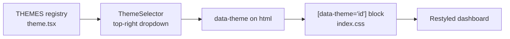

# Themes

A record of the visual themes for the Weather Starter dashboard: the theme list, each
theme's description, and the design considerations behind them. The active theme is
chosen from the selector at the top right and remembered between visits.

## How theming works

Every theme is a self-contained visual layer. Adding one does not touch the data, the
map, the add-location flow, the refresh behaviour, or the backend API.

- Register the theme in the `THEMES` array in `frontend/src/theme/theme.tsx`
  (`{ id, label, description }`).
- Add a matching `[data-theme='<id>']` block in `frontend/src/index.css`.
- `frontend/src/components/ThemeSelector.tsx` renders every registered theme
  automatically, so no component changes are needed.

### Dark themes vs light themes

The base components use frosted white glass surfaces and white text, which read well on a
dark backdrop.

- **Dark themes** only need to swap the `body` background and retint the accent (the
  selected card, focus rings, and scrollbar). The white text ramp stays as is.
- **Light themes** must override the exact Tailwind utility classes the components use.
  Tailwind arbitrary-opacity classes such as `bg-white/[0.08]` bake a literal colour into
  the CSS and cannot be flipped through a variable, so a light theme retargets each class
  with a theme-scoped selector, for example
  `[data-theme='cupertino'] .bg-white\/\[0\.08\]`. This is why light themes carry a much
  larger CSS block than dark ones.

The default theme is set as `data-theme="apple"` in `frontend/index.html` so the first
paint matches the saved design with no flash.

## Implemented themes

These themes are live in the selector.

| # | Theme | Kind | Description |
| --- | --- | --- | --- |
| 0 | Apple | Dark | Frosted glass over a deep sky gradient. |
| 1 | Aurora Glass | Dark | Refined frosted glass with a vivid aurora glow over deep navy. |
| 2 | Cupertino Light | Light | Crisp white cards with soft shadows on an off-white daytime backdrop. |
| 3 | Midnight Mono | Dark | Near-black, high-contrast night mode with flat panels and a cyan accent. |
| 4 | Terminal Green | Dark | Monospace phosphor-green readout on a near-black CRT backdrop. |
| 5 | Paper Almanac | Light | Warm parchment with serif type, sepia ink, and a terracotta accent. |
| 6 | Neo-Brutalist | Light | Stark high-contrast panels with thick black borders and hard offset shadows. |
| 7 | Sunrise Warm | Dark | A warm dawn gradient of plum, coral, and amber with an amber accent. |
| 8 | Ocean Deep | Dark | Deep sea gradient of teal and abyssal blue with an aqua accent. |
| 9 | Forecast Newsprint | Light | Editorial newspaper look: off-white stock, serif type, ruled dividers, and a restrained ink-red accent. |
| 10 | Pastel Soft | Light | Gentle pastel gradient with rounded cards, soft shadows, and a calm low-contrast palette. |
| 11 | Synthwave Grid | Dark | Retro 1980s neon over a deep purple sky with a glowing grid and a hot-magenta accent. |

### Design considerations, theme by theme

- **Apple.** The original design, saved as a theme so it can be restored. Layered sky
  radial gradients under frosted white glass; the reference point for every other theme.
- **Aurora Glass.** Keeps the frosted glass but sets it over deep navy with cyan, violet,
  and emerald aurora glows. A pure backdrop swap, accent left neutral white.
- **Cupertino Light.** The first light theme, so it established the override technique:
  opaque white cards with soft shadows, a slate text ramp inverted from the white ramp, a
  faint sky tint on the selected card, and light focus rings and scrollbar.
- **Midnight Mono.** Near-black flat charcoal panels rather than glass, hairline borders,
  a single cyan accent on the selected card, focus rings, and scrollbar. The white text
  ramp is kept for contrast.
- **Terminal Green.** A monospace, phosphor-CRT treatment. The white text ramp is
  retinted to green (including placeholders), surfaces become flat green-tinted panels,
  and borders, focus rings, and scrollbar go green.
- **Paper Almanac.** A print-almanac light theme: warm parchment gradient, serif body
  font, a sepia-ink ramp, opaque parchment cards with soft warm shadows, sepia hairlines,
  and a terracotta accent.
- **Neo-Brutalist.** A light theme built for contrast: flat off-white backdrop, bold sans
  font, near-black text, flat white cards with hard offset shadows and no blur, thick
  solid-black borders, squared corners, and an electric-yellow accent on selection.
- **Sunrise Warm.** A dark theme with a plum-to-ember dawn gradient and warm coral and
  amber glows, keeping the white glass legible, with an amber accent.
- **Ocean Deep.** A dark theme with a teal-to-abyssal-blue gradient and soft aqua and cyan
  glows, keeping the white glass legible, with an aqua accent.
- **Forecast Newsprint.** A light editorial theme: a flat, cool off-white newsprint stock,
  serif body type, and a near-black cool-ink text ramp. Crisp flat near-white column cards
  with faint shadows and thin ruled ink hairlines evoke printed columns, with a single
  restrained ink-red accent on the selected card, focus rings, and scrollbar. Kept cool
  and editorial to read distinctly from the warm Paper Almanac.
- **Pastel Soft.** A gentle, low-contrast light theme: a near-white backdrop washed with
  soft lavender, mint, and peach pastels, a muted indigo-slate text ramp to keep contrast
  calm, and clean white cards with extra corner rounding and soft shadows for a friendly
  feel. A soft lilac accent marks the selected card, focus rings, and scrollbar.
- **Synthwave Grid.** A dark retro-1980s theme: a deep purple sky gradient lit by magenta
  and cyan glows and a faint neon grid drawn with repeating gradients, keeping the white
  glass legible, with a hot-magenta accent on the selected card, focus rings, and scrollbar.

## Proposed themes

These were part of the original brainstorm and are not yet built. The notes below are the
intended direction to guide implementation, not final specifications. Each will follow the
same pattern: a dark theme swaps the backdrop and accent, while a light theme needs the
full utility-class override.

| # | Theme | Kind | Intended direction |
| --- | --- | --- | --- |
| 12 | Nordic Calm | Light | Muted Scandinavian palette, plenty of whitespace, thin borders, understated blue-grey accent. |
| 13 | Sunny Meadow | Light | Bright daytime greens and sky blues, cheerful warm accent, friendly rounded cards. |
| 14 | Slate Pro | Dark | Restrained professional dashboard: neutral slate greys, subtle borders, a single measured accent, compact density. |
| 15 | High-Contrast Accessible | Dark | Maximum legibility: pure high-contrast foreground and background, bold focus states, large hit areas, strong accent for selection. |

## Change log

- Apple saved as the baseline theme, and the theme selector added.
- Implemented, in list order: Aurora Glass, Cupertino Light, Midnight Mono, Terminal
  Green, Paper Almanac, Neo-Brutalist, Sunrise Warm, Ocean Deep, Forecast Newsprint,
  Pastel Soft, Synthwave Grid.
