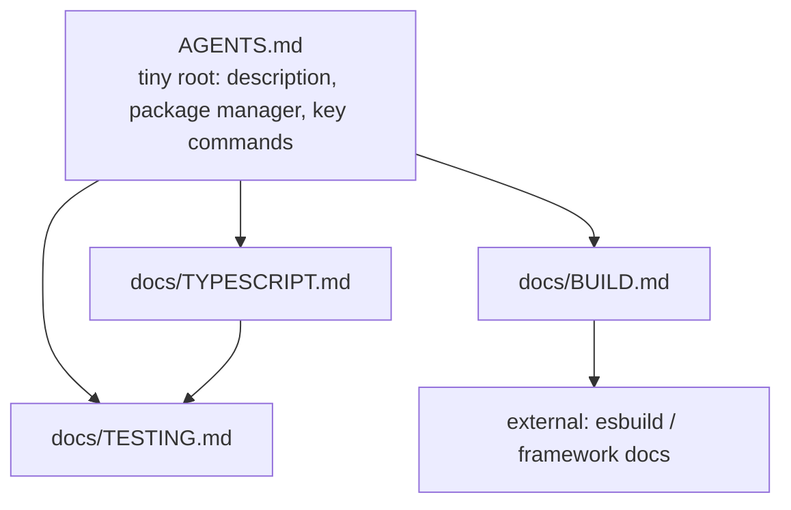

# A complete guide to AGENTS.md

Notes from "A Complete Guide To AGENTS.md" on how to write an `AGENTS.md` file that helps
an AI coding agent rather than slowing it down. This is the article the refactor prompt in
this repository came from.

Reference: <https://www.aihero.dev/a-complete-guide-to-agents-md>

## What AGENTS.md is

An `AGENTS.md` file is a markdown file you check into git that customises how AI coding
agents behave in your repository. It sits at the top of the conversation, just below the
system prompt, so it acts as a configuration layer between the agent's base instructions
and your codebase. It can hold personal guidance (commit style, patterns you prefer) and
project guidance (what the project does, which package manager you use, architecture
decisions).

It is an open standard supported by many tools, though not all. Claude Code reads
`CLAUDE.md` rather than `AGENTS.md`; you can symlink one to the other so every tool sees
the same content.

## Why large files hurt

Every token in `AGENTS.md` is loaded on every request, whether or not it is relevant, so a
bloated file wastes tokens and distracts the agent. The article points to an "instruction
budget": drawing on Humanlayer's writing, it notes that frontier thinking models follow
roughly 150 to 200 instructions with reasonable consistency, and smaller or non-thinking
models manage fewer. Past that budget, more rules make performance worse, not better.

Files tend to grow into a "ball of mud": the agent does something you dislike, you add a
rule, and this repeats for months as different people add conflicting opinions. The advice
is to be ruthless and keep the file as small as possible, and to avoid auto-generated
`AGENTS.md` files, which favour comprehensiveness over restraint.

Staleness is a second danger. Because the agent reads the file on every request, out-of-
date content actively poisons its context. This is worst when you document file paths,
which change often: a rule pointing at a moved file sends the agent confidently to the
wrong place. Prefer describing capabilities and stable domain concepts over exact
structure, and let the agent work out the current layout during planning.

## The minimal root file

Treat this as the absolute minimum for the root file:

- A one-sentence project description, which anchors every decision the agent makes.
- The package manager, if it is not npm (for example "This project uses pnpm workspaces").
- Non-standard build or typecheck commands.

Almost everything else belongs elsewhere.

## Progressive disclosure

Progressive disclosure means giving the agent only what it needs now and pointing it to
the rest. Move topic-specific rules (TypeScript conventions, testing, build details) into
separate files and reference them with a light, conversational touch, so those rules load
only when that work comes up. Nest the references into a discoverable tree, and link to
external docs where useful. Agent skills are another form of the same idea: knowledge
pulled in only when needed.

## Monorepos

You are not limited to one file at the root. `AGENTS.md` files in subdirectories merge
with the root, so the root can describe the monorepo's purpose and shared tooling while
each package keeps its own tech stack and conventions. Keep every level focused and avoid
overloading any single one.

## How this repository applies it

This repository follows the same shape:

- `AGENTS.md` at the root is a thin pointer to `.github/copilot-instructions.md`.
- `.github/copilot-instructions.md` holds only the essentials and links onward.
- `docs/` holds the detail, grouped by topic (`development.md`, `architecture.md`,
  `conventions.md`, `theming.md`), so each file loads only when that work comes up.
