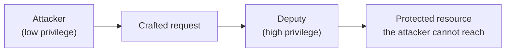

# The confused deputy attack

A confused deputy is a privileged program that is tricked by a less privileged attacker
into misusing its authority. The deputy holds legitimate permissions; the attacker does
not. By supplying crafted input, the attacker gets the deputy to act with the deputy's
own rights, reaching resources the attacker could never touch directly.

The root cause is that authority is tied to the deputy's identity, its ambient
permissions, rather than to the request. The deputy cannot tell "do this for me" from
"do this for the attacker", so it carries out both with the same privilege.

## The classic example

Norm Hardy described the pattern in 1988. A compiler runs with permission to write billing
records to a protected file, `BILL`. It accepts an argument naming the file for its debug
output. A user has no access to `BILL`, but passes `BILL` as the output path. The compiler,
authorised to write there, overwrites the billing data on the user's behalf. The user could
not corrupt the file directly. The compiler could, and was confused into doing it.

## Common modern forms

- **Cross-site request forgery (CSRF)**, the browser is the deputy. It attaches your
  session cookie to a forged cross-site request, so the server acts as though you asked.
- **Server-side request forgery (SSRF)**, a server is the deputy. It fetches an
  attacker-supplied URL and reaches internal services or a cloud metadata endpoint that
  only it can access.
- **API proxies and OAuth**, a service calls a downstream API with its own key on behalf
  of untrusted input, lending its privilege to the caller.
- **AI agents and tools**, an agent with broad workspace and credential access is steered
  by prompt injection into acting for an attacker, a confused deputy with a large blast
  radius.

## Defences

- Pass authority with the request, not through ambient identity. Capability tokens or
  scoped credentials tie each action to the caller who is entitled to it.
- Constrain the target. Allowlist the URLs, paths, or files a deputy may act on, and reject
  anything outside the list.
- Enforce least privilege. Give each component only the access its job needs, so a
  confused deputy can do little harm.
- Require explicit confirmation for sensitive actions rather than performing them on any
  input that arrives.

Treat an agent's access as part of your threat model. The more autonomy and workspace
access an agent holds, the more carefully you should isolate it, limit its credentials, and
scrutinise any input that could steer it, whether through prompt injection or confused
deputy behaviour.

## Sources

- Norm Hardy, "The Confused Deputy (or why capabilities might have been invented)", ACM
  SIGOPS Operating Systems Review, volume 22, issue 4, 1988.
- OWASP, "Server Side Request Forgery" and "Cross-Site Request Forgery (CSRF)":
  <https://owasp.org/www-community/attacks/csrf>
