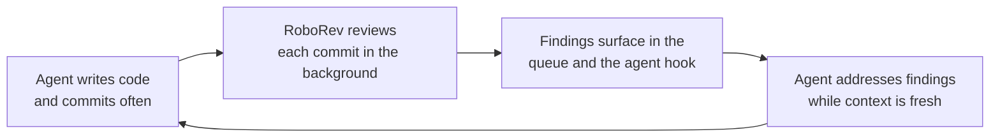

# Continuous code review for coding agents

AI coding agents write code quickly, but they make mistakes, and most review feedback
arrives too late: by the time a human looks, the agent has moved on and the context is
lost. Continuous code review closes that gap by reviewing each commit as it lands and
bringing the findings straight back to the agent while the work is fresh.

[RoboRev](https://www.roborev.io/) is one tool built around this idea. Its source is on
GitHub at [kenn-io/roborev](https://github.com/kenn-io/roborev). The notes below summarise
how it works.

## The write, review, fix loop

The pattern is to have the agent commit often, ideally every turn, and let the reviewer run
in the background so nothing waits on a human.



## How it works

- **Post-commit reviews.** A git hook reviews every commit automatically, with any agent, so
  issues surface in seconds rather than hours.
- **Agent hook.** When review work piles up, a hook nudges your CLI agent to run the fix
  skill mid-session. You can also copy findings into the agent, use `/roborev-fix`, or run
  `roborev fix` to apply fixes automatically.
- **Refine before you ship.** `/roborev-refine` re-reviews and fixes a whole branch until
  every review passes, catching bugs before the pull request.

## What it is

- **A review ledger.** Reviews accumulate in a persistent queue that behaves like a ledger:
  nothing is closed until it is explicitly addressed, so findings do not fall through the
  cracks.
- **Multi-agent.** Works with Codex, Claude Code, Gemini, Copilot, OpenCode, Cursor, Droid,
  Kilo, Kiro, and Pi, and auto-detects the agents you have installed.
- **Local.** No hosted service or extra infrastructure. Reviews are orchestrated on your
  machine using the coding agents you already have configured.
- **Built-in analysis.** Ships analysis types the agent can act on directly: duplication,
  complexity, refactoring, test fixtures, and dead code.
- **Terminal UI.** Reviews render as full Markdown in a terminal queue view (`roborev tui`).

## Architecture

- **Daemon.** An HTTP server on port 7373, which auto-finds a free port if that one is busy.
- **Workers.** A pool of parallel review workers (four by default, configurable).
- **Storage.** SQLite at `~/.roborev/reviews.db` in WAL mode.
- **Config.** Global at `~/.roborev/config.toml`, per repository at `.roborev.toml`.
- **Multi-machine sync.** Optionally sync reviews bi-directionally across machines through a
  shared PostgreSQL database, while each daemon keeps its local SQLite for fast access.

## Quick start

Install, then set up the hook and browse reviews from inside a git repository:

```bash
curl -fsSL https://roborev.io/install.sh | bash

roborev init   # install the post-commit hook
# do some work, generate commits
roborev tui    # browse reviews in the terminal UI
```
