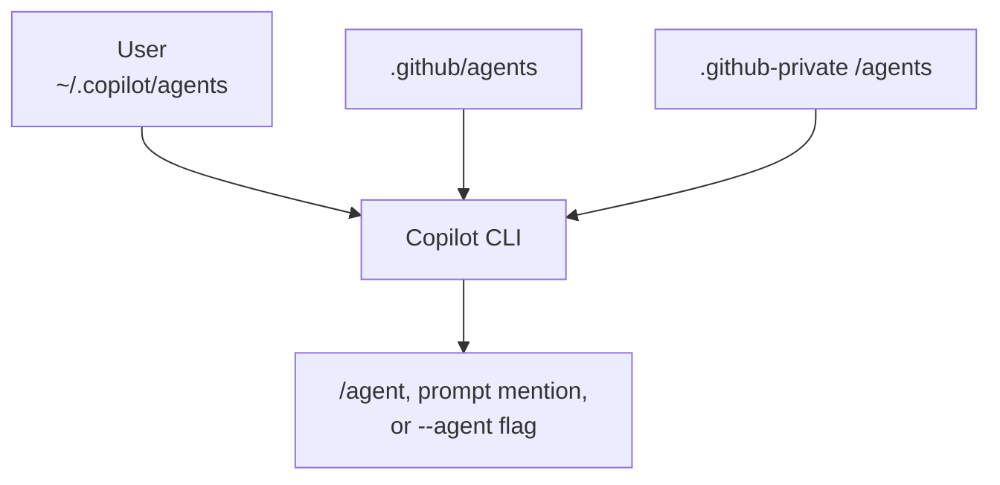

# Creating a subagent in GitHub Copilot CLI

A subagent in Copilot CLI is a custom agent: a specialised version of Copilot with its own
expertise, tool access, and instructions. The main agent can delegate a focused task to one
so the work runs in a separate context and the main conversation stays clear. For why that
matters, see the Subagents section in [agent-stack.md](agent-stack.md); this note covers how
to create one.

## The built-in agents

Copilot CLI ships with a default set you can use straight away:

- **Explore**, quick codebase analysis without adding to your main context.
- **Task**, runs commands such as tests and builds, with a brief summary on success and full
  output on failure.
- **General purpose**, complex multi-step work needing the full toolset, in its own context.
- **Code review**, reviews changes and surfaces only genuine issues.
- **Research**, deep research across the codebase, related repositories, and the web, with
  citations.
- **Rubber duck**, an independent critic that Copilot consults automatically.

Run `/agent` to browse and select from the available agents.

## How to create a custom agent

A custom agent is defined by an agent profile: a Markdown file with YAML frontmatter for the
configuration, followed by the agent's prompt.

1. Create a file named `<name>.agent.md`. The name may use only these characters: `.`, `-`,
   `_`, `a-z`, `A-Z`, `0-9`.
2. Set the frontmatter. Only `description` is required:
   - `name`, optional, defaults to the filename without the suffix.
   - `description`, required, a brief statement of what the agent does and its expertise.
   - `tools`, optional, a list of tool names or aliases the agent may use, including tools
     from configured MCP servers. Omit it to grant all available tools.
   - `mcp-servers`, optional, MCP servers available only to this agent.
   - `model` and `target`, optional, to pin the model or limit the agent to one environment.
3. Write the prompt below the frontmatter. This defines the agent's behaviour, expertise, and
   instructions, up to 30,000 characters.

### Where the profile lives

The location decides the scope. On a naming conflict the higher scope wins, so a
system-level agent overrides a repository one, which overrides an organisation one.

| Scope | Location | Available in |
| --- | --- | --- |
| User | `~/.copilot/agents` | All your projects |
| Repository | `.github/agents` | The current project |
| Organisation or enterprise | `/agents` in the `.github-private` repository | All projects in the org or enterprise |



### Example profile

A repository agent that only plans, saved as `.github/agents/planner.agent.md`:

```text
---
name: planner
description: Produces implementation plans and technical specifications, without writing production code
tools: ["read", "search", "edit"]
---

You are a technical planning specialist. For each request:

- Break the requirement down into concrete, ordered tasks with dependencies.
- Record the API design, data model, and key interactions.
- Write the plan as structured Markdown with headings and acceptance criteria.
- Note testing, deployment, and the main risks.

Produce thorough documentation rather than implementing the code.
```

## Using a custom agent

Once the profile is in place, invoke the agent in any of these ways:

- Run `/agent` and select it from the list.
- Name it in a prompt, for example "Use the planner agent to scope this feature". Copilot
  infers which agent you mean.
- Pass it on the command line: `copilot --agent=planner --prompt "Scope this feature"`.

Two related commands help with subagents: `/subagents` configures the default and per-agent
models, and `/fleet` enables parallel subagent execution.

## Sources

- GitHub Docs, "Using GitHub Copilot CLI" (Use custom agents):
  <https://docs.github.com/en/copilot/how-tos/use-copilot-agents/use-copilot-cli>
- GitHub Docs, "Creating custom agents":
  <https://docs.github.com/en/copilot/how-tos/copilot-on-github/customize-copilot/customize-cloud-agent/create-custom-agents>
