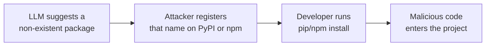

# Package hallucinations in code-generating LLMs

When a code-generating model recommends a dependency that does not exist in the package
repository, it produces a package hallucination. The USENIX Security 2025 paper "We Have a
Package for You!" studies the phenomenon at scale and shows it is a systemic software
supply-chain risk, not an occasional slip.

## The threat

A hallucinated package name is a ready-made supply-chain attack. An attacker observes a
name that a popular model invents repeatedly, then registers a real package under that name
on PyPI or npm and fills it with malicious code. A developer who trusts the model's
suggestion runs `pip install` or `npm install` on the invented name and pulls the
attacker's code into their project. The victim never mistypes anything: the model supplies
the wrong name, and the attacker is waiting on the other end. The paper frames this as a
new form of package confusion attack.

## Key findings

The authors ran 30 tests across 16 models for Python and 14 for JavaScript, producing
576,000 code samples and 2.23 million package references.

- 440,445 of those references, 19.7 per cent, were hallucinations, including 205,474
  distinct package names that do not exist.
- Open-source models hallucinated far more than commercial ones: an average of 21.7 per
  cent against 5.2 per cent, roughly four times higher.
- GPT-4 Turbo had the lowest overall rate at 3.59 per cent. DeepSeek 1B was the best of the
  open-source models at 13.63 per cent.
- Python code hallucinated less than JavaScript, 15.8 per cent against 21.3 per cent on
  average, though the two languages were positively correlated.
- The hallucinations are persistent, not random noise. Re-running a prompt that produced a
  hallucination ten times, 43 per cent of hallucinated packages appeared in all ten runs
  and 58 per cent recurred more than once. A name that keeps coming back is exactly what an
  attacker needs to target.
- Models can often recognise their own mistakes. Tested as a detector, models such as
  GPT-4 Turbo flagged their hallucinated names with better than 75 per cent accuracy.

## Defences

The paper tests mitigations and finds several that cut the hallucination rate while keeping
code quality acceptable:

- **Retrieval-augmented generation**, grounding the model against a real list of packages
  so invented names can be caught before they reach the developer.
- **Self-refinement**, prompting the model to review and correct its own output, which
  works because the model can detect many of its own hallucinations.
- **Supervised fine-tuning**, which lowers the rate but can reduce code quality, so it
  needs care.

For day-to-day work the practical rule is simple: never install a dependency just because a
model named it. Verify that each package exists, is the one you intended, and is
maintained, before adding it to a project. Pin and audit dependencies, and prefer a
lockfile so a name cannot be swapped under you later.

## Source

- Joseph Spracklen, Raveen Wijewickrama, A H M Nazmus Sakib, Anindya Maiti, Bimal
  Viswanath, and Murtuza Jadliwala, "We Have a Package for You! A Comprehensive Analysis of
  Package Hallucinations by Code Generating LLMs", 34th USENIX Security Symposium, August
  2025: <https://www.usenix.org/system/files/usenixsecurity25-spracklen.pdf>
