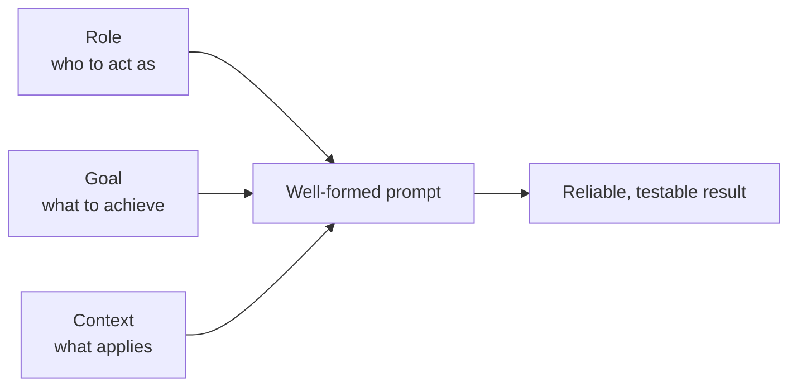

# Prompt engineering: the three pillars

A short, practical note for writing prompts that produce reliable engineering work. A good
prompt rests on three pillars. Get them right and the model spends its effort on the
problem rather than guessing what you meant.

## The three pillars

| Pillar | Focus | Why it matters |
| --- | --- | --- |
| Role | Who the AI should act as | Shapes the quality bar, architectural bias, and general problem-solving posture. |
| Goal | What needs to be achieved | Eliminates vague targets by defining concrete, testable outcomes and pointing to specific files. |
| Context | What parameters apply | Prevents unwanted code rewrites by setting clear boundaries and providing essential background detail. |

## How the pillars fit together



## Each pillar in practice

### Role

Set who the model should be before you say what to do. The role fixes the quality bar and
the instincts the model brings, so a senior specialist reaches for tests, edge cases, and
existing patterns without being asked.

- Weaker: "Fix the map."
- Stronger: "Act as a senior React and TypeScript engineer who values small, surgical
  changes and follows the existing component conventions."

### Goal

State the outcome as something you can verify, and name the files involved. A concrete goal
removes ambiguity and gives you a clear test for done.

- Weaker: "Make the forecast cards work."
- Stronger: "Populate `forecast_periods` and `daily_forecast` in
  `backend/src/weather.ts` so both forecast cards render live data, and add tests in
  `backend/src/weather.test.ts` that prove it."

### Context

Supply the parameters that apply: the boundaries, the data shapes, the patterns to reuse,
and anything the model must not change. Context is what stops a small request turning into
a broad rewrite.

- Weaker: "Use the weather API."
- Stronger: "Use the existing `two-hr-forecast` implementation in
  `backend/src/weather.ts` as the pattern for calling
  `https://api-open.data.gov.sg/v2/real-time/api/air-temperature`. Do not change the
  route handlers or the database schema."

## A reusable template

```text
Role:    You are a [seniority + speciality] who [values / prioritises ...].
Goal:    [Concrete, testable outcome], in [specific files/paths].
Context: Follow [existing pattern/file]. Constraints: [what to keep, what not to touch].
         Inputs/shapes: [endpoints, data formats, examples].
Done when: [observable check, for example tests pass or a card renders live data].
```

## Quick checklist before you send

- Have I named the role and the quality bar I expect?
- Is the goal something I can test, and does it point at specific files?
- Have I set the boundaries, so the model changes only what I intend?
- Have I given the patterns, data shapes, or examples the model needs?
- Have I said how we will both know the work is done?
